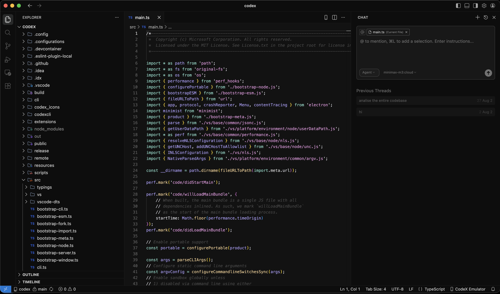
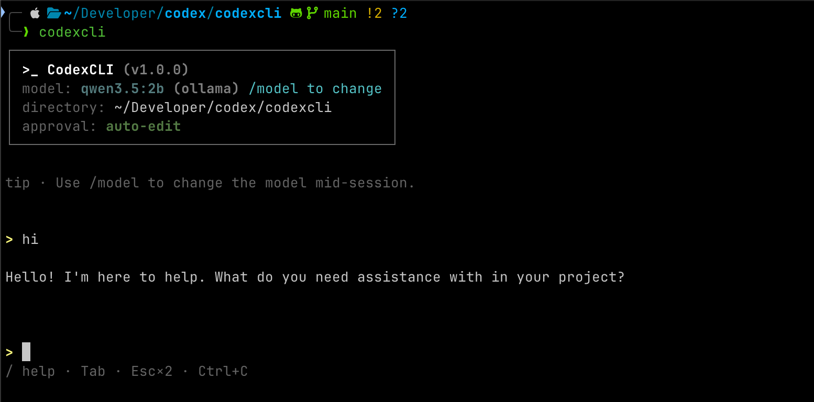
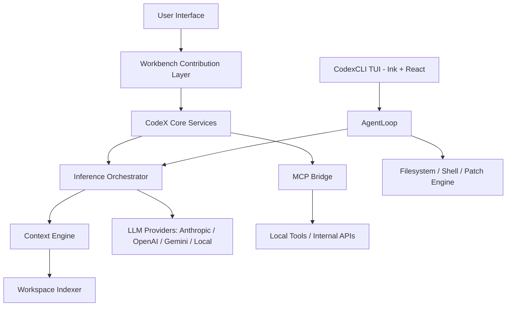

<p align="center">
  
</p>

<p align="center">
  
  
  
  
</p>

---

# CodeX — AI-Native Engineering Environment

**Developed by [Suryanshu Nabheet](mailto:suryanshunab@gmail.com)**

CodeX is a next-generation development ecosystem built on a custom-hardened VS Code foundation. Rather than layering AI capabilities through a narrow extension API, CodeX re-engineers the workbench core to deliver **Native AI Orchestration** — treating intelligence as a primary platform service, not an afterthought.

The ecosystem ships as **two integrated products**:

| Product | What it is |
|---------|-----------|
| **CodeX IDE** | AI-native engineering environment with a deep workbench integration — full agentic sidebar, inline diffs, autocomplete, MCP, SCM, and more. |
| **CodexCLI** | Autonomous terminal coding agent that edits real files, runs real commands, and streams responses live — all from the shell. |

---

## Screenshots

### CodeX IDE

<p align="center">
  
</p>

*The CodeX IDE showing the agentic chat sidebar, project file explorer with the integrated CodexCLI directory, and Monaco editor — running in full AI orchestration mode.*

---

### CodexCLI

<p align="center">
  
</p>

*CodexCLI in interactive TUI mode — showing the live model session header (model, directory, approval policy) and streaming response.*

---

## Design Philosophy

Most AI-assisted editors operate through a thin extension layer with no meaningful access to internal editor state. CodeX takes a fundamentally different approach.

The AI engine has **direct access** to internal workbench services — TextMate grammar resolution, the global search index, SCM state, and task runner pipelines — enabling a level of contextual fidelity that surface-level integrations cannot achieve. All inference operations are dispatched through VS Code's extension host worker thread model, ensuring the editor UI remains fully responsive regardless of LLM operation complexity.

Underpinning every interaction is the **Unified Context Engine**: a project-wide indexer that constructs a high-fidelity semantic representation of the active codebase. This representation is what the model actually reasons over — not a limited buffer of recently opened files.

---

## Core Features

### CodeX IDE

#### Autonomous AI Sidebar (`Ctrl+L`)

A React-powered command interface that resides in the editor's auxiliary bar.

- **Multimodal Input**: Accepts text, images, and direct codebase references (`@file`, `@folder`, `@commit`, `@branch`, `@terminal`) within a single interaction.
- **Agentic Workflow Execution**: Orchestrates complex, multi-file operations autonomously — refactoring across a module, updating all usages of an interface, or restructuring a directory — without requiring step-by-step supervision.
- **Real-Time Reasoning Visualization**: A purpose-built `ThoughtBlock` component surfaces the model's intermediate reasoning steps as they are produced.
- **Checkpoint & Restore**: Automatic file snapshots before every agentic action allow instant rollback to any prior state.

#### Inline Code Transformation (`Cmd+K`)

A precision tool for in-editor code manipulation.

- **Semantic Diff Projection**: CodeX computes structured diffs and renders them as View Zones within the active editor buffer, enabling contextual review without switching panels.
- **Convention-Aware Generation**: Leverages a 2,000+ line context window around the cursor to ensure generated code conforms to the stylistic and structural conventions already present in the project.
- **AI Undo Stack**: All AI-generated changes maintain a separate, reversible undo history — decoupled from the native VS Code undo stack.

#### Model Context Protocol (MCP) — Native Implementation

First-class support for the MCP standard, implemented at the platform layer rather than as an extension shim.

- **Dynamic Tool Discovery**: Automatically detects and registers local tools — filesystem access, terminal execution, web search — without manual configuration.
- **Secure API Bridging**: Exposes a standardized, schema-validated bridge for safely connecting the AI engine to internal or sensitive APIs.

#### Production-Grade SCM Integration

- **CodeX Commit**: Generates conventional, semantically accurate commit messages derived from deep AST-level analysis of staged changes — not surface-level diffs.
- **Sync Orchestration**: Native push/pull controls with integrated AI-assisted conflict resolution guidance surfaced directly within the merge workflow.

#### AI Autocomplete

- **FIM (Fill-In-the-Middle)**: Sub-50ms predictive inline completions using prefix and suffix context.
- **LRU Cache**: Maintains a high-hit-rate completion cache across cursor positions.

---

### CodexCLI

CodexCLI is a production-grade autonomous terminal coding agent. It edits real files, runs real commands, and streams responses live. Every tool call hits the actual workspace — this is not a chat demo.

#### Key Capabilities

- Operates on a **real filesystem** — create, edit, delete, and patch files inside the project root
- Runs **real shell commands** with configurable approval policies and optional sandboxing
- Streams assistant tokens **live** in the TUI as they are produced
- Queues follow-ups while a turn is running (`/stop` cancels; queue drains next)
- Supports **skills** (custom slash prompts), `/plan`, `/init`, `/doctor`, `/cost`, todos, explore, and `web_fetch`
- **Multi-provider**: OpenAI-compatible, Anthropic, Gemini, OpenRouter, Ollama, and more

#### Autonomy & Approval Modes

| Mode | Flag | Behaviour |
|------|------|-----------|
| Suggest | *(default)* | Confirm every edit and shell command |
| Auto-edit | `--auto-edit` | Auto-approve file edits; confirm shell |
| Full-auto | `--full-auto` | Auto-approve everything (prefer sandboxed roots) |

#### Slash Commands

| Command | Purpose |
|---------|---------|
| `/stop` `/cancel` | Stop current turn; queued follow-ups run next |
| `/queue` `/queue clear` | Inspect or drop follow-ups |
| `/plan [topic]` | Plan-only turn (no edits until you approve) |
| `/init` | Create a starter `AGENTS.md` for the project |
| `/doctor` | Health check — config, key, skills, sessions |
| `/cost` `/status` | Token usage and session info |
| `/compact` | Summarize context when approaching limits |
| `/model` `/provider` `/approval` | Switch settings mid-session |
| `/resume` `/sessions` | Browse and resume prior sessions |
| `/diff` `/todos` `/pwd` `/help` `/clear` `/exit` | Utilities |

---

## Supported LLM Providers

Both the IDE and the CLI support the same provider ecosystem:

| Provider | Notes |
|----------|-------|
| **Anthropic** | Claude Opus, Sonnet, Haiku — with native extended thinking |
| **OpenAI** | GPT-4.1, o3, o4-mini, and variants |
| **Google Gemini** | Gemini 2.0 Flash, 2.5 Pro |
| **Mistral** | Chat + FIM |
| **Groq** | Ultra-low latency inference |
| **xAI (Grok)** | Grok-4, Grok-3 |
| **DeepSeek** | DeepSeek Coder, DeepSeek V3 |
| **OpenRouter** | Unified gateway to 200+ models |
| **Ollama** | Local models — Llama, Qwen, Mistral, CodeLlama … |
| **vLLM / LM Studio / LiteLLM** | OpenAI-compatible local endpoints |
| **Google Vertex AI** | Enterprise Gemini via GCP |
| **Microsoft Azure AI** | Azure Foundry deployments |
| **AWS Bedrock** | Via LiteLLM or Bedrock Access Gateway proxy |

---

## Technical Architecture



### Module Breakdown

| Module | Location | Description |
|--------|----------|-------------|
| **IDE Frontend** | `src/vs/workbench/contrib/codex/browser` | Sidebar React application, View Zone renderers, and premium UI components. |
| **IDE Logic** | `src/vs/workbench/contrib/codex/common` | Inference services, state management, and the `EditCodeService`. |
| **IDE Main Process** | `src/vs/workbench/contrib/codex/electron-main` | Multi-provider streaming engine, MCP daemon, and SCM channel. |
| **CLI Agent** | `codexcli/src/agent` | `AgentLoop`, tool registry, skills, explore, and usage tracking. |
| **CLI Providers** | `codexcli/src/providers` | OpenAI-compatible, Anthropic, and Gemini adapters. |
| **CLI TUI** | `codexcli/src/tui` | Ink + React terminal UI with live streaming and scrollback. |
| **CLI Filesystem** | `codexcli/src/fs` | Project-root scoped filesystem with path traversal protection. |
| **CLI Patch Engine** | `codexcli/src/patch` | Unified diff apply with on-disk verification. |

---

## Repository Structure

```
codex/
├── src/
│   └── vs/workbench/contrib/codex/
│       ├── browser/                    # IDE: services, React app, ViewZone engine
│       │   ├── react/src/              # Sidebar, QuickEdit, Settings (React 19 + Tailwind)
│       │   ├── editCodeService.ts      # Diff engine, ViewZones, AI undo stack
│       │   ├── chatThreadService.ts    # Agentic chat state machine + checkpoints
│       │   ├── autocompleteService.ts  # FIM engine with LRU cache
│       │   ├── contextGatheringService.ts
│       │   ├── toolsService.ts         # Built-in tool executor
│       │   └── ...
│       ├── common/                     # IDE: shared types, settings, model capabilities
│       │   ├── modelCapabilities.ts    # Model registry (ctx window, FIM, reasoning)
│       │   ├── codexSettingsService.ts
│       │   ├── mcpService.ts
│       │   ├── sendLLMMessageService.ts
│       │   └── prompt/prompts.ts       # System prompts and tool schemas
│       └── electron-main/              # IDE: main process — streaming engine, IPC
│           ├── llmMessage/
│           │   ├── sendLLMMessage.impl.ts  # Multi-provider streaming engine
│           │   └── extractGrammar.ts       # Thought blocks, XML tools, diff parsing
│           ├── mcpChannel.ts               # MCP stdio/SSE subprocess manager
│           └── sendLLMMessageChannel.ts
│
├── codexcli/                           # Autonomous terminal coding agent
│   ├── src/
│   │   ├── agent/      # AgentLoop, tools, skills, explore, usage
│   │   ├── config/     # ~/.codex config + env loader
│   │   ├── context/    # Repo context packing
│   │   ├── exec/       # Shell + sandbox execution
│   │   ├── fs/         # Project-root scoped filesystem
│   │   ├── git/        # Git utilities
│   │   ├── models/     # Model metadata
│   │   ├── patch/      # Unified diff apply engine
│   │   ├── providers/  # LLM backends (OpenAI, Anthropic, Gemini)
│   │   ├── tui/        # Ink + React terminal UI
│   │   └── utils/      # Shared helpers
│   ├── bin/codexcli.js
│   ├── build.mjs
│   └── scripts/        # setup.sh, dev.sh, stage_release.sh, init_firewall.sh
│
├── extensions/                         # Bundled VS Code extensions
│   ├── codex-commit/
│   ├── codex-error-lens/
│   ├── codex-pathintellisense/
│   ├── codex-pdfviewer/
│   ├── codex-project-tree/
│   ├── codex-sync/
│   ├── codex-theme/
│   ├── codex-timeline/
│   └── emulator/
│
├── assets/
│   ├── branding/                       # Source brand art + icon generation script
│   │   ├── generate-app-icons.mjs      # Builds platform icons into resources/
│   │   └── CodeX-Curve.png             # Master logo art
│   ├── readme.png                      # README hero image
│   └── screenshots/                    # Product screenshots for README
│
├── resources/                          # Platform app icons (built from assets/branding)
│
├── scripts/
│   ├── setup.sh        # End-to-end IDE setup (deps → React → compile → launch)
│   └── code.sh         # Launch CodeX IDE
├── product.json
└── package.json
```

---

## Bundled IDE Extensions

| # | Extension | Location |
|---|-----------|----------|
| 1 | CodeX Sync | `extensions/codex-sync` |
| 2 | CodeX Onboarding | `src/vs/workbench/contrib/onboarding` |
| 3 | CodeX Error Lens | `extensions/codex-error-lens` |
| 4 | CodeX Project Tree | `extensions/codex-project-tree` |
| 5 | CodeX Theme | `extensions/codex-theme` |
| 6 | CodeX Commit | `extensions/codex-commit` |
| 7 | CodeX Timeline | `extensions/codex-timeline` |
| 8 | CodeX Emulator | `extensions/emulator` |
| 9 | CodeX PDF Viewer | `extensions/codex-pdfviewer` |
| 10 | CodeX Path Intellisense | `extensions/codex-pathintellisense` |

---

## Prerequisites

| Dependency | IDE | CLI | Required Version |
|------------|:---:|:---:|-----------------|
| Node.js | ✅ | ✅ | `v20.x` or `v22.x` (LTS) |
| Rust | ✅ | — | Latest stable (native modules) |
| Python | ✅ | — | `3.10`–`3.13` (build scripts) |

---

## Build and Launch

### CodeX IDE

```bash
# Clone the repository
git clone https://github.com/Suryanshu-Nabheet/CodeX.git && cd CodeX

# End-to-end setup: installs deps, builds React, compiles, and launches
./scripts/setup.sh

# Or step by step:
npm install
cd src/vs/workbench/contrib/codex/browser/react && node build.js && cd -
npm run compile
./scripts/code.sh
```

### CodexCLI

```bash
# From the repository root
cd codexcli

# Install and build
npm install
npm run build

# Link globally — exposes `codexcli` on your PATH (optional)
npm link

# Or one-shot:
./scripts/setup.sh    # also available as: npm run setup
```

#### Run CodexCLI

```bash
# Interactive TUI
codexcli .

# With an inline prompt
codexcli "add a health check endpoint and tests"

# Choose provider and model
codexcli -p claude -m claude-sonnet-4 "optimize the query layer"
codexcli -p gemini -m gemini-2.0-flash "add unit tests"
codexcli -p ollama -m codellama "explain this package"

# Auto-edit mode
codexcli --auto-edit "refactor auth middleware"

# Quiet / CI mode
codexcli -q "fix lint failures in src/"
```

#### CodexCLI Configuration

On first launch, a setup wizard saves your config to:

```
~/.codex/config.json   — provider, model, approval mode, instructions
~/.codex.env           — loaded on every launch
```

```json
{
  "provider": "openai",
  "model": "gpt-4.1",
  "approvalMode": "auto-edit",
  "instructions": "Prefer small diffs. Run tests after edits."
}
```

Environment variable overrides:

```bash
export OPENAI_API_KEY="sk-..."
export CLAUDE_API_KEY="sk-ant-..."
export GEMINI_API_KEY="..."
export OPENROUTER_API_KEY="sk-or-..."
# Ollama: no key required — run `ollama serve`
```

---

## Security and Privacy

CodeX is built on a **Zero-Trust AI Architecture**. The following guarantees are enforced by design, not policy:

- **Local-First Indexing**: All vector embeddings and workspace indexes are generated and stored on-device. No codebase data is transmitted to intermediary servers.
- **Direct Provider Communication**: API requests travel directly from the local machine to the configured LLM provider. No CodeX-operated relay or proxy is involved.
- **Telemetry Removed**: All default VS Code telemetry pipelines have been excised from the build to ensure absolute data sovereignty.
- **CodexCLI Sandboxing**: Filesystem operations are scoped to the project root. Approval gates protect mutating tools and shell commands. Destructive operations always require explicit confirmation.

---

## Contributing

Contributions from the community are welcome. Please review the [Contributing Guide](CONTRIBUTING.md) for the project's code of conduct, branch conventions, and pull request process before opening a submission.

---

## License

CodeX is governed by the **CodeX Open Source Initiative**.

Technical Lead: [Suryanshu Nabheet](mailto:suryanshunab@gmail.com)
