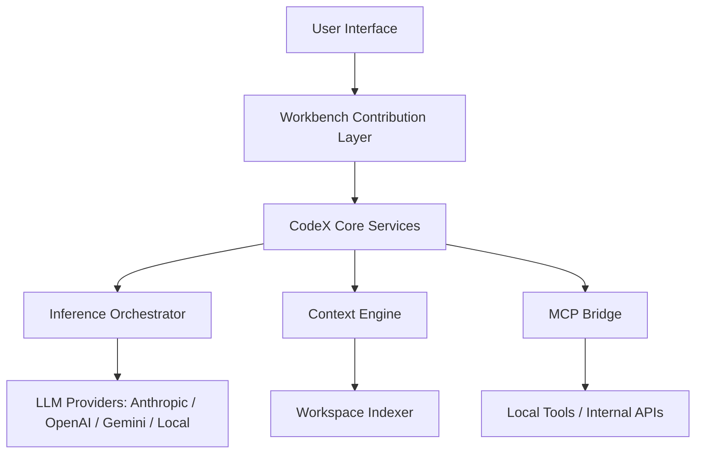

<p align="center">
  
</p>

<p align="center">
  
  
  
</p>

---

# CodeX — AI-Native Engineering Environment

**Developed by [Suryanshu Nabheet](mailto:suryanshunab@gmail.com)**

CodeX is a next-generation development environment built on a custom-hardened VS Code foundation. Rather than layering AI capabilities through a narrow extension API, CodeX re-engineers the workbench core to deliver **Native AI Orchestration** — treating intelligence as a primary platform service, not an afterthought. The result is deep contextual awareness, high-performance inference, and autonomous agentic workflows that operate at the level of the IDE itself.

---

## Design Philosophy

Most AI-assisted editors operate through a thin extension layer with no meaningful access to internal editor state. CodeX takes a fundamentally different approach.

The AI engine has **direct access** to internal workbench services — TextMate grammar resolution, the global search index, SCM state, and task runner pipelines — enabling a level of contextual fidelity that surface-level integrations cannot achieve. All inference operations are dispatched through VS Code's extension host worker thread model, ensuring the editor UI remains fully responsive regardless of LLM operation complexity.

Underpinning every interaction is the **Unified Context Engine**: a project-wide indexer that constructs a high-fidelity semantic representation of the active codebase. This representation is what the model actually reasons over — not a limited buffer of recently opened files.

---

## Core Features

### Autonomous AI Sidebar

A React-powered command interface that resides in the editor's auxiliary bar.

- **Multimodal Input**: Accepts text, images, and direct codebase references within a single interaction.
- **Agentic Workflow Execution**: Instructs the model to orchestrate complex, multi-file operations autonomously — refactoring across a module, updating all usages of an interface, or restructuring a directory — without requiring step-by-step supervision.
- **Real-Time Reasoning Visualization**: A purpose-built `ThoughtBlock` component surfaces the model's intermediate reasoning steps as they are produced, giving engineers transparency into the decisions being made on their behalf.

### Inline Code Transformation (Cmd+K)

A precision tool for in-editor code manipulation.

- **Semantic Diff Projection**: CodeX computes structured diffs and renders them as View Zones within the active editor buffer, enabling contextual review without switching panels.
- **Convention-Aware Generation**: Leverages a 2,000+ line context window around the cursor to ensure generated code conforms to the stylistic and structural conventions already present in the project.

### Model Context Protocol (MCP) — Native Implementation

First-class support for the MCP standard, implemented at the platform layer rather than as an extension shim.

- **Dynamic Tool Discovery**: Automatically detects and registers local tools — filesystem access, terminal execution, web search — without manual configuration.
- **Secure API Bridging**: Exposes a standardized, schema-validated bridge for safely connecting the AI engine to internal or sensitive APIs.

### Production-Grade SCM Integration

Intelligent version control tooling woven into the standard SCM workflow.

- **CodeX Commit**: Generates conventional, semantically accurate commit messages derived from deep AST-level analysis of staged changes — not surface-level diffs.
- **Sync Orchestration**: Native push/pull controls with integrated AI-assisted conflict resolution guidance surfaced directly within the merge workflow.

---

## Bundled Extensions

| # | Extension | Location |
|---|-----------|----------|
| 1 | CodeX Sync | `extensions/codex-sync` |
| 2 | CodeX Onboarding | `src/vs/workbench/contrib/onboarding` |
| 3 | CodeX Error Lens | `extensions/codex-error-lens` |
| 4 | CodeX Project Tree | `extensions/codex-project-tree` |
| 5 | CodeX Theme | `extensions/codex-theme` |
| 6 | CodeX Commit | `extensions/codex-commit` |
| 7 | CodeX Timeline | `extensions/codex-timeline` |
| 8 | CodeX Emulator | `extensions/emulator` |
| 9 | CodeX PDF Viewer | `extensions/codex-pdfviewer` |
| 10 | CodeX Path Intellisense | `extensions/codex-pathintellisense` |

---

## Technical Architecture



### Module Breakdown

| Module | Location | Description |
|--------|----------|-------------|
| **Frontend** | `src/vs/workbench/contrib/codex/browser` | Sidebar React application, View Zone renderers, and premium UI components. |
| **Logic** | `src/vs/workbench/contrib/codex/common` | Inference services, state management, and the `EditCodeService`. |
| **Protocols** | `src/vs/platform/codex` | Core protocol implementations for MCP and direct LLM provider streaming. |

---

## Prerequisites

| Dependency | Required Version |
|------------|-----------------|
| Node.js | `v20.x` or `v22.x` (LTS recommended) |
| Rust | Latest stable (required for native modules) |
| Python | `3.10` or later (required for build scripts) |

---

## Build and Launch

```bash
# Clone the repository
git clone https://github.com/Suryanshu-Nabheet/CodeX.git && cd CodeX

# Install the full dependency tree
npm install

# Compile the base workbench
npm run compile

# Start the CodeX runtime
./scripts/code.sh
```

---

## Security and Privacy

CodeX is built on a **Zero-Trust AI Architecture**. The following guarantees are enforced by design, not policy:

- **Local-First Indexing**: All vector embeddings and workspace indexes are generated and stored on-device. No codebase data is transmitted to intermediary servers.
- **Direct Provider Communication**: API requests travel directly from the local machine to the configured LLM provider. No CodeX-operated relay or proxy is involved.
- **Telemetry Removed**: All default VS Code telemetry pipelines have been excised from the build to ensure absolute data sovereignty.

---

## Contributing

Contributions from the community are welcome. Please review the [Contributing Guide](CONTRIBUTING.md) for the project's code of conduct, branch conventions, and pull request process before opening a submission.

---

## License

CodeX is governed by the **CodeX Open Source Initiative**.

Technical Lead: [Suryanshu Nabheet](mailto:suryanshunab@gmail.com)
