<!--
"window.zoomLevel": 0.9,// & 1.9
"workbench.colorTheme": "Prism",
"editor.rulers": [40, 80, 120, 130],
-->

### Real talk: this is one of the most annoying extensions out there. Unless you are learning to code, I recommend keeping the inline message disabled by default and binding a hotkey to toggle it:

```js
// keybindings.json
{
    "key": "ctrl+u",
    "command": "codexErrorLens.toggleInlineMessage",
    //          ^ Toggles global setting `codexErrorLens.messageEnabled`
},
```

### If you don't want to go with the hotkey route - it's possible to:

1) Exclude problems (in workspace, by source, by code, by message) [**excludeByMessage**](#codexErrorLensexcludebymessage), [**excludeBySource**](#codexErrorLensexcludebysource), [**excludePatterns(Glob)**](#codexErrorLensexcludepatterns), [**excludeWorkspaces**](#codexErrorLensexcludeworkspaces)
1) Show fewer decorations (render decoration only on the active line) [**followCursor**](#codexErrorLensfollowcursor)
1) Delay showing decorations (delay ms / on document save) [**delay**](#codexErrorLensdelay), [**onSave**](#codexErrorLensonsave), [**ignoreDirty**](#codexErrorLensignoredirty)
1) Transform problem message (make it shorter maybe) [**replace**](#codexErrorLensreplace)
1) Configure other settings or colors to make it less distracting

### 1. Exclude problems:

```js
"codexErrorLens.excludeByMessage": [
    "Missing semicolon",
    "Newline required at end of file but not found",
    "More than 1 blank line not allowed",
],
// OR
"codexErrorLens.excludeBySource": [
    "eslint(padded-blocks)",
],
```

### 2. Show only active line decoration or closest problem:

```js
"codexErrorLens.followCursor": "activeLine",
// OR
"codexErrorLens.followCursor": "closestProblem",
```

### 3. Delay showing problems:

```js
"codexErrorLens.delay": 1500,
// OR
"codexErrorLens.onSave": true,
```

### 4. Transform problem message:

<table>
<tbody>
<tr>
<td>

```js
"codexErrorLens.replace": [
    {
        "matcher": "is declared but its value is never read",
        "message": "ಠ╭╮ಠ",
    },
],
```

</td>
<td>

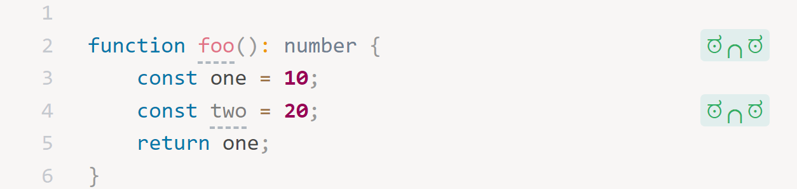

</td>
</tr>
</tbody>
</table>

---

## Settings (70+)

### `codexErrorLens.enabled`

Toggle all decorations and features (background highlighting, inline message, gutter icons, status bar message, code lens).
Extension adds a command to toggle this setting: `codexErrorLens.toggle` **CodeX Error Lens: Toggle (Enable/Disable) Everything**

### `codexErrorLens.respectUpstreamEnabled`

Disable decorations or features when VSCode setting `problems.visibility` ("Controls whether the problems are visible throughout the editor and workbench") is disabled.

### `codexErrorLens.enabledInMergeConflict`

Disable decorations when file has merge conflict symbols `<<<<<<<` or `=======` or `>>>>>>>`.

### `codexErrorLens.fontFamily`

Change font family of inline message. Not supported natively by VSCode. Non-monospace fonts can usually fit more characters in the same space. May break [codexErrorLens.alignMessage](#codexErrorLensalignmessage).

<table>
<tbody>

<!-- ──────────────────────────────────────────────────────────── -->
<tr>
<th>""</th>
<td>

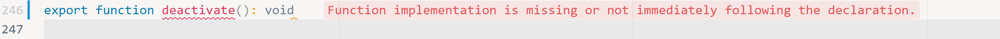

</td>
</tr>
<!-- ──────────────────────────────────────────────────────────── -->
<tr>
<th>"Arial"</th>
<td>

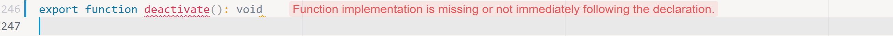

</td>
</tr>
<!-- ──────────────────────────────────────────────────────────── -->
<tr>
<th>"Times"</th>
<td>

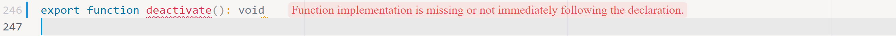

</td>
</tr>
<!-- ──────────────────────────────────────────────────────────── -->
<tr>
<th>"Helvetica"</th>
<td>

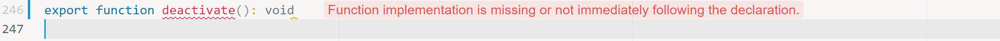

</td>
</tr>
<!-- ──────────────────────────────────────────────────────────── -->
<tr>
<th>"Gabriola"</th>
<td>

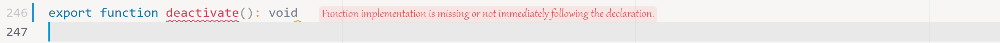

</td>
</tr>
<!-- ──────────────────────────────────────────────────────────── -->
<tr>
<th>"Calibri"</th>
<td>

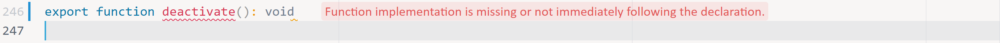

</td>
</tr>
<!-- ──────────────────────────────────────────────────────────── -->
<tr>
<th>"Comic Sans MS"</th>
<td>

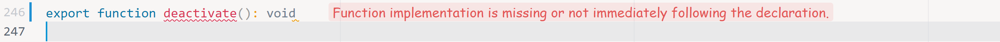

</td>
</tr>
<!-- ──────────────────────────────────────────────────────────── -->
<tr>
<th>"Cascadia Code"</th>
<td>

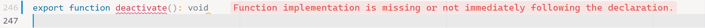

</td>
</tr>
<!-- ──────────────────────────────────────────────────────────── -->
<tr>
<th>"Segoe Print"</th>
<td>

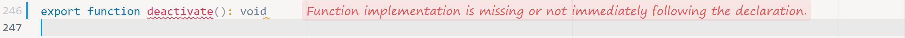

</td>
</tr>
<!-- ──────────────────────────────────────────────────────────── -->

</tbody>
</table>

### `codexErrorLens.fontWeight`

Whether to use bold or not font weight for messages.

<table>
<tbody>
<tr>
<th align="center">"normal"</th>
<th align="center">"bold"</th>
</tr>
<tr>
<td>

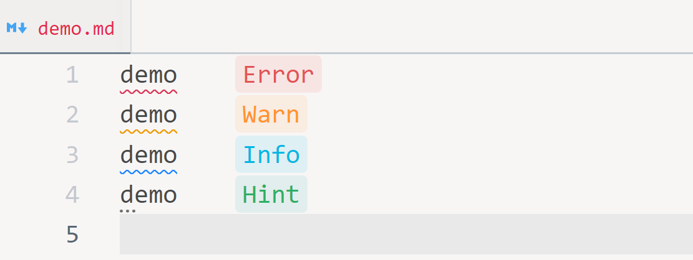

</td>

<td>

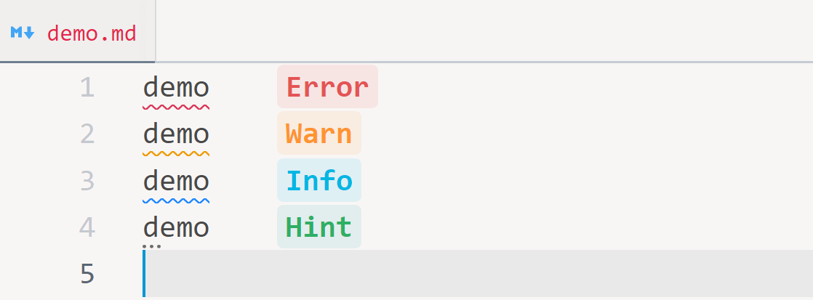

</td>

</tr>
</tbody>
</table>

### `codexErrorLens.fontStyleItalic`

Whether to use italic font style or not for messages.

<table>
<thead>
<tr>
<th align="center">false</th>
<th align="center">true</th>
</tr>
</thead>
<tbody>
<tr>
<td>

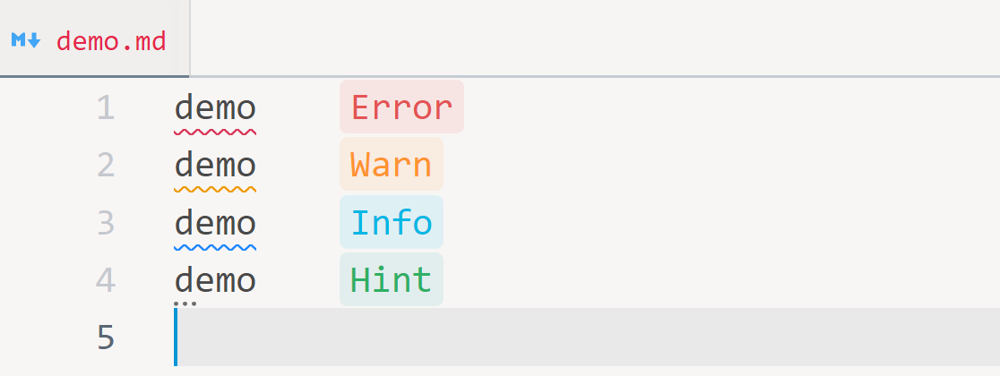

</td>

<td>

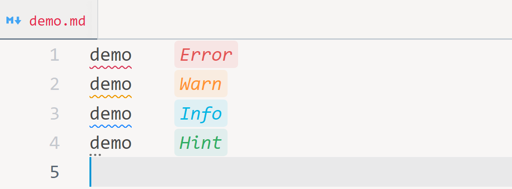

</td>

</tr>
</tbody>
</table>

### `codexErrorLens.fontSize`

Change font size of inline message. Not supported natively by VSCode. Mostly useful to make message smaller, not bigger. Use negative value to have it relative to the editor's fontSize (e.g. `-3px`). May break [codexErrorLens.alignMessage](#codexErrorLensalignmessage).

<table>
<tbody>

<tr>
<th>""</th>
<td>

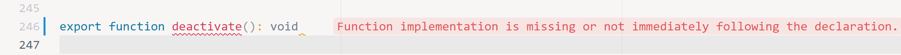

</td>
</tr>

<tr>
<th>"12px"</th>
<td>

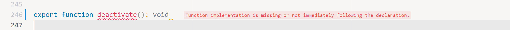

</td>
</tr>

</tbody>
</table>


### `codexErrorLens.margin`

Extra space between the end of the line (end of text) and the inline message.

<table>
<thead>
<tr>
<th align="center">"4ch"</th>
<th align="center">"0"</th>
<th align="center">"100px"</th>
</tr>
</thead>
<tbody>
<tr>
<td>

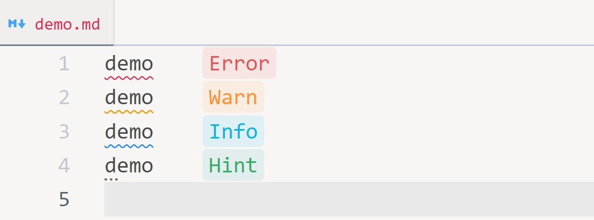

</td>

<td>

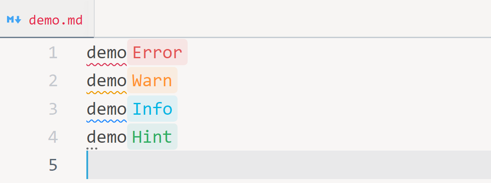

</td>

<td>

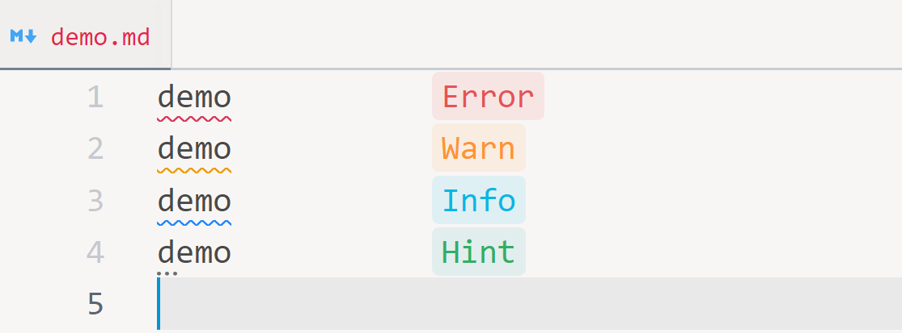

</td>

</tr>
</tbody>
</table>

### `codexErrorLens.alignMessage`

Align message to be in the same column (if possible). Only works with monospace fonts.

<table>
<tbody>

<tr>
<td>

```js
"codexErrorLens.alignMessage": {
    "start": 40,
    "end": 0,
    "padding": [0, 0.5],
},
```

</td>
<td>

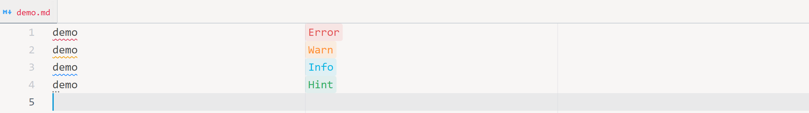

</td>
</tr>

<tr>
<td>

```js
"codexErrorLens.alignMessage": {
    "start": 0,
    "end": 80,
    "padding": [0, 0.5],
},
```

</td>
<td>

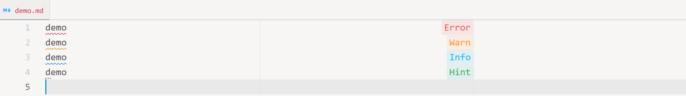

</td>
</tr>

</tbody>
</table>

### `codexErrorLens.border`

<table>
<tbody>

<tr>
<td>

```js
"codexErrorLens.border": [
	"1px solid",
	"1px dotted",
	"1px dashed",
	"1px solid #00000040",
],
```

</td>
<td>

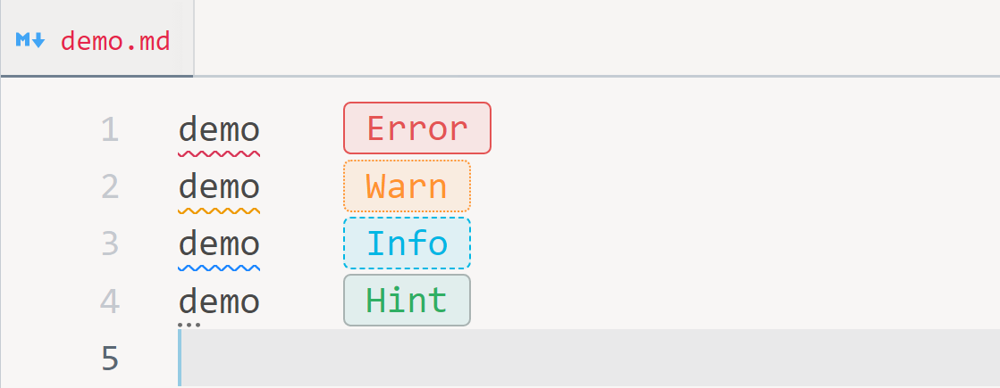

</td>
</tr>

</tbody>
</table>

### `codexErrorLens.padding`

Add space around the inline message. Only visible when [codexErrorLens.messageBackgroundMode](#codexErrorLensmessagebackgroundmode) is set to `message`.

<table>
<tbody>
<tr>
<th align="center">"0"</th>
<th align="center">"2px 0.5ch"</th>
</tr>
<tr>
<td>

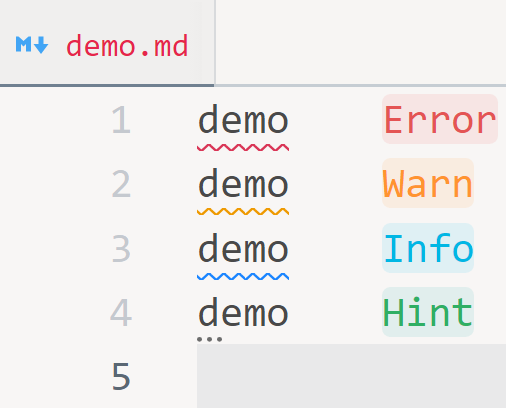

</td>

<td>

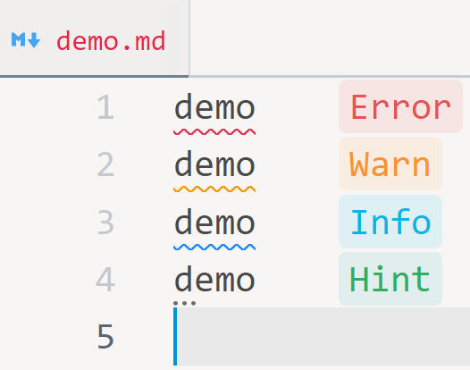

</td>

</tr>
</tbody>
</table>

### `codexErrorLens.borderRadius`

Round corners for inline message. Only visible when [codexErrorLens.messageBackgroundMode](#codexErrorLensmessagebackgroundmode) is set to `message`.

<table>
<thead>
<tr>
<th align="center">"0.3em"</th>
<th align="center">"0"</th>
<th align="center">"50%"</th>
<th align="center">"10px 30px 10px 30px"</th>
</tr>
</thead>
<tbody>
<tr>
<td>

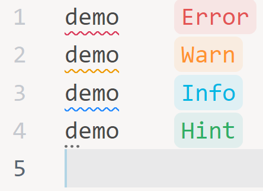

</td>

<td>

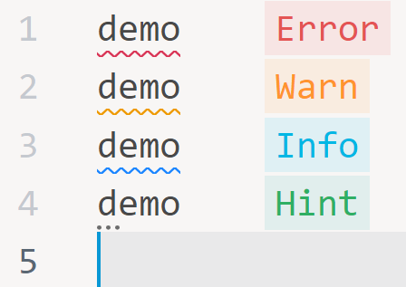

</td>

<td>

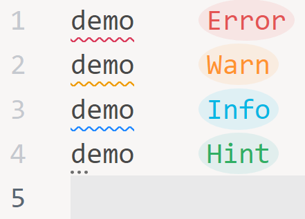

</td>

<td>

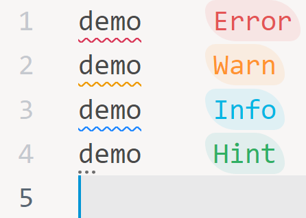

</td>

</tr>
</tbody>
</table>

### `codexErrorLens.enabledDiagnosticLevels`

Controls which diagnostics to include (error/warning/info/hint) for all features of this extension (decorations, gutter, status bar, code lens,...).

<table>
<thead>
<tr>
<th align="center">["error", "warning", "info", "hint"]</th>
<th align="center">["error", "warning"]</th>
<th align="center">["error", "info"]</th>
</tr>
</thead>
<tbody>
<tr>
<td>

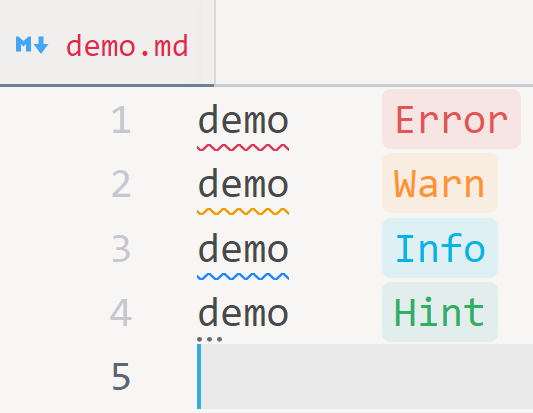

</td>

<td>

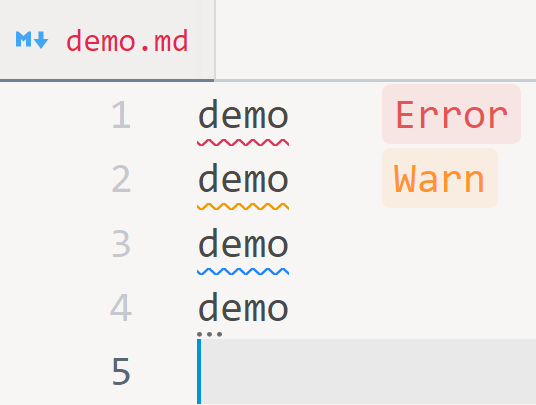

</td>

<td>

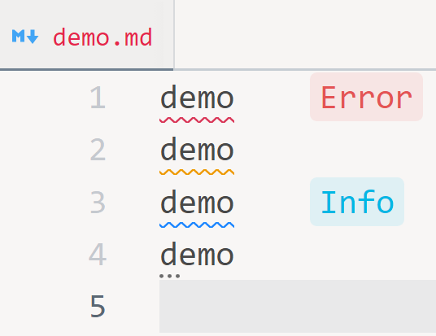

</td>

</tr>
</tbody>
</table>

### `codexErrorLens.messageTemplate`

Template used for all inline messages. Possible variables:

- `$message` - diagnostic message text
- `$count` - Number of diagnostics on the line
- `$severity` - Severity prefix taken from [codexErrorLens.severityText](#codexErrorLensseveritytext)
- `$source` - Source of diagnostic e.g. \"eslint\"
- `$code` - Code of the diagnostic

<table>
<tbody>

<tr>
<td>

```js
"codexErrorLens.messageTemplate": "[$count] $severity $message $source($code)",
```

</td>
</tr>

<tr>
<td>

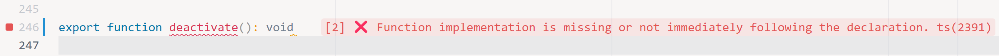

</td>
</tr>

</tbody>
</table>

### `codexErrorLens.messageMaxChars`

<table>
<tbody>

<tr>
<th align="center">500</th>
<td>

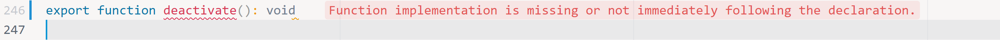

</td>
</tr>

<tr>
<th align="center">50</th>
<td>

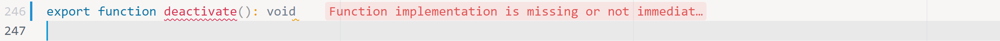

</td>

</tr>
</tbody>
</table>

### `codexErrorLens.severityText`

Replaces `$severity` variable in [codexErrorLens.messageTemplate](#codexErrorLensmessagetemplate).

<table>
<tbody>

<tr>
<td>

```js
"codexErrorLens.messageTemplate": "$severity $message",
"codexErrorLens.severityText": [
    "❌",
    "⚠",
    "ℹ",
    "📗",
],
```

</td>
<td>

```js
"codexErrorLens.messageTemplate": "$severity $message",
"codexErrorLens.severityText": [
    "■",
    "■",
    "■",
    "■",
],
```

</td>
</tr>

<tr>
<td>

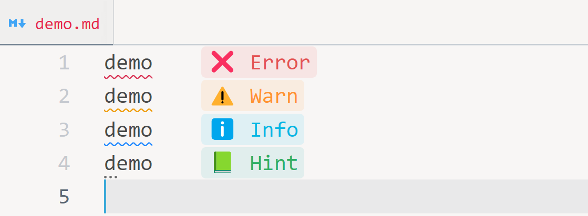

</td>

<td>

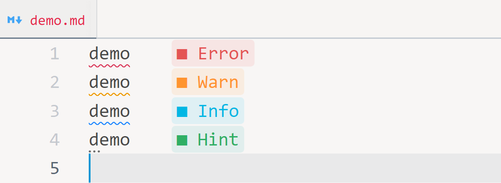

</td>
</tr>

<tr>
<td>

```js
"codexErrorLens.messageTemplate": "$severity $message",
"codexErrorLens.severityText": [
    "▣",
    "◈",
    "◉",
    "⛆",
],
```

</td>
<td>

```js
"codexErrorLens.messageTemplate": "$severity$message",
"codexErrorLens.severityText": [
    "ERROR: ",
    "WARNING: ",
    "",
    "",
],
```

</td>
</tr>

<tr>
<td>

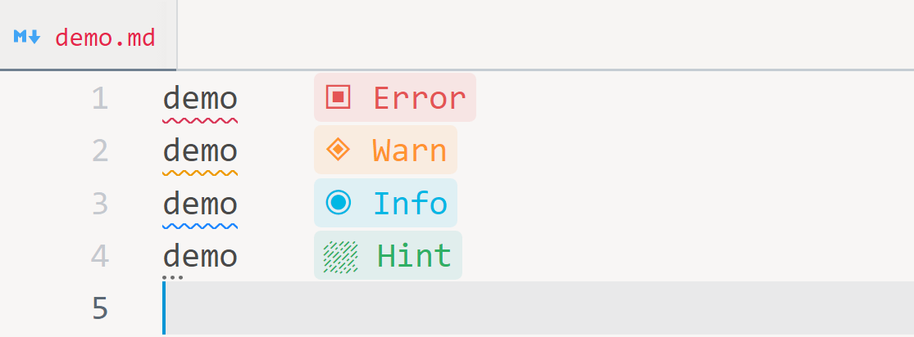

</td>

<td>

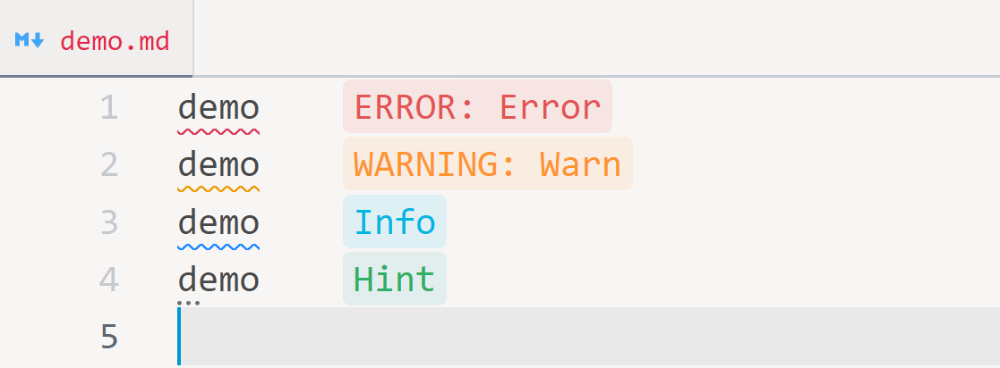

</td>
</tr>

</tbody>
</table>

### `codexErrorLens.messageEnabled`

Controls visibility of inline message (including background highlighting). Doesn't include gutter icons.

<table>
<tbody>

<tr>
<th>true</th>
<th>false</th>
</tr>

<tr>
<td>

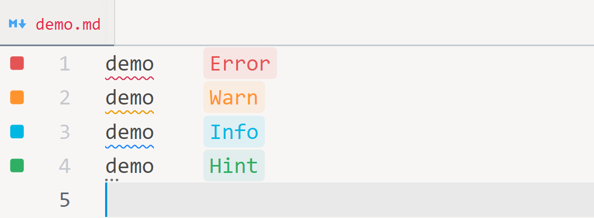

</td>
<td>

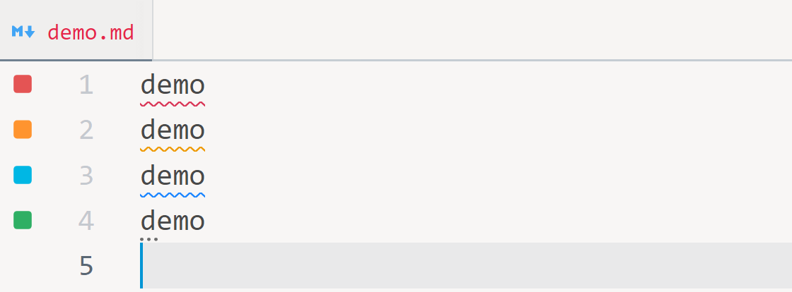

</td>
</tr>

<tr>


</tr>
</tbody>
</table>

### `codexErrorLens.messageBackgroundMode`

<table>
<thead>
<tr>
<th align="center">"line"</th>
<th align="center">"message"</th>
<th align="center">"none"</th>
</tr>
</thead>
<tbody>
<tr>
<td>

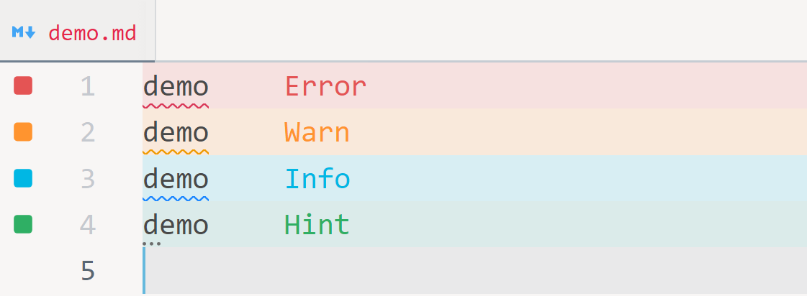

</td>

<td>


</td>

<td>

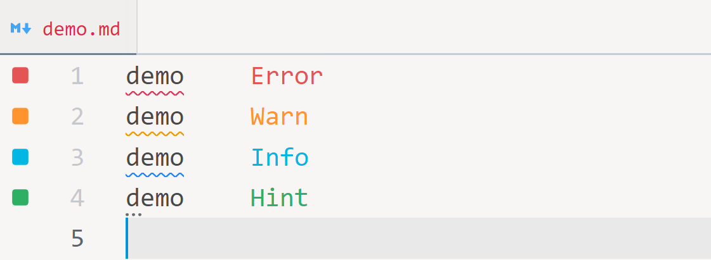

</td>

</tr>
</tbody>
</table>

### `codexErrorLens.problemRangeDecorationEnabled`

VSCode now supports natively highlighting problem ranges even without this extension (except `hint` severity):

<table>
<tbody>
<tr>
<td>

```js
"workbench.colorCustomizations": {
    "editorError.background": "#ff000030",
    "editorWarning.background": "#ee990030",
    "editorInfo.background": "#0095d530",
},
```

</td>
<td>

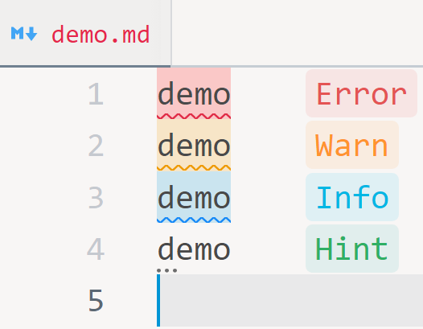

</td>
</tr>

</tbody>
</table>


Still, it might be useful if you decide to disable native error highlighting and use the one from this extension (after delay or use different highlighting methods like borders):

<table>
<tbody>
<tr>
<td>

```js
"workbench.colorCustomizations": {
    "editorError.foreground": "#fff0",
    "editorWarning.foreground": "#fff0",
    "editorInfo.foreground": "#fff0",
    "editorHint.foreground": "#fff0",
},

"codexErrorLens.problemRangeDecorationEnabled": true,

"codexErrorLens.decorations": {
    "errorRange": {
        "border": "1px dashed red",
        "backgroundColor": "#ff000090",
        "color": "#ffffff",
    },
    "warningRange": {
        "border": "2px dotted #fa9121",
    },
    "infoRange": {
        "textDecoration": ";background:linear-gradient(45deg,#ff8400,#00d9ff);background-clip:text;color:transparent;border-bottom:2px solid #00d9ff",
        "backgroundColor": "#fff0",
    },
    "hintRange": {
        "textDecoration": ";box-shadow:0 0 5px 3px #2faf6470;border-radius:0.25em",
    },
},
```

</td>
</tr>

<tr>
<td>

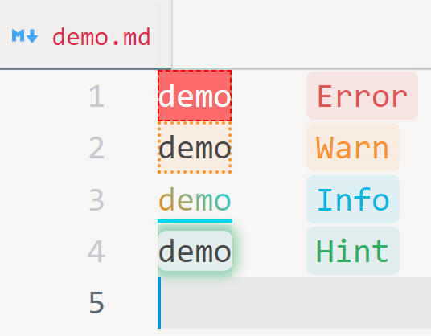

</td>
</tr>

</tbody>
</table>

### `codexErrorLens.editorHoverPartsEnabled`

Controls which parts of hover are enabled (for the text editor; Doesn't affect status bar message hover).

- `messageEnabled` - Shows problem message.
- `sourceCodeEnabled` Shows prblem `source` & `code` and buttons to copy them to the clipboard
- `buttonsEnabled` - Show buttons like `Exclude`, `Open Definition`, `Search`...

### `codexErrorLens.statusBarIconsEnabled`

Show icons for Errors & Warnings in status bar similar to native ones, but with the ability to change color / background color.

<table>
<tbody>

<tr>
<td>

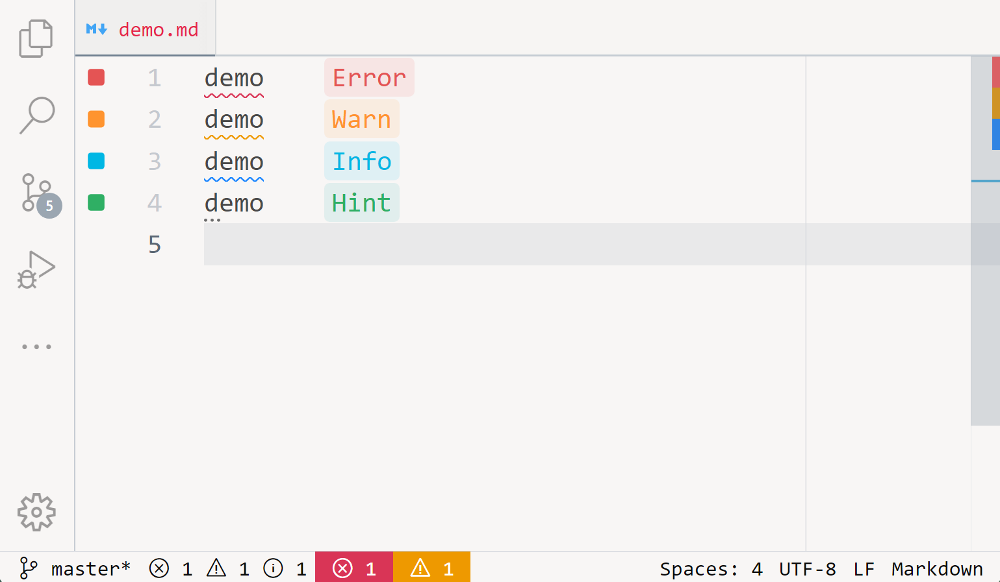

</td>
<td>

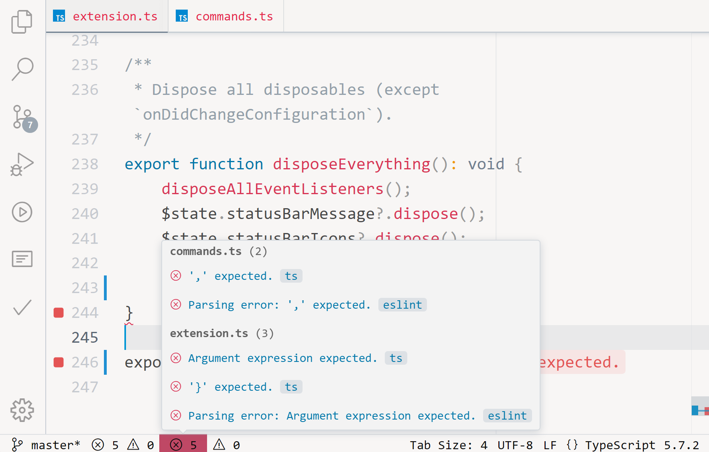

</td>
</tr>

<tr>


</tr>
</tbody>
</table>

### `codexErrorLens.statusBarIconsPriority`

Move status bar icons right/left.

### `codexErrorLens.statusBarIconsAlignment`

Choose alignment of the status bar icons left/right side of the viewport.

### `codexErrorLens.statusBarIconsTargetProblems`

Choose what to include in counters for problems (status bar icons).

### `codexErrorLens.statusBarIconsUseBackground`

When enabled - highlight status bar with background colors. Only 2 VSCode colors allowed (`statusBarItem.errorBackground` & `statusBarItem.warningBackground`).

### `codexErrorLens.statusBarIconsAtZero`

Choose what happens to status bar icons when there are no errors - hide or remove background color.

### `codexErrorLens.statusBarMessageEnabled`

Show problem message in Status Bar.

<table>
<tbody>

<tr>
<td>

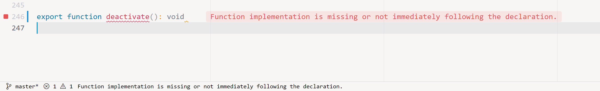

</td>
</tr>

<tr>
<td>

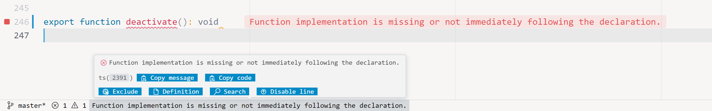

</td>
</tr>

</tbody>
</table>

Show problem message in Status Bar.

### `codexErrorLens.statusBarMessageType`

Choose which diagnostic to use for status bar message:

- `closestProblem` - Closest to the cursor diagnostic
- `closestSeverity` - Closest to the cursor diagnostic sorted by severity (e.g. error will be shown before warning even if it's farther from the cursor)
- `activeLine` - Show only diagnostic that is on the same line as the cursor
- `activeCursor` - Similar to `activeLine` but follows the cursor movement inside the line

### `codexErrorLens.statusBarMessagePriority`

Move status bar icons right/left.

### `codexErrorLens.statusBarMessageAlignment`

Choose alignment of the status bar message left/right side of the viewport.

### `codexErrorLens.statusBarColorsEnabled`

Uses colors `codexErrorLens.statusBarErrorForeground`, `codexErrorLens.statusBarWarningForeground`, `codexErrorLens.statusBarInfoForeground`, `codexErrorLens.statusBarHintForeground`.

<table>
<tbody>

<tr>
<th>false</th>
<td>

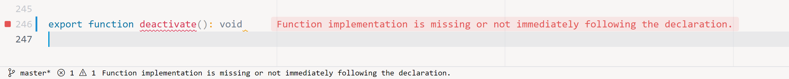

</td>
</tr>

<tr>
<th>true</th>
<td>

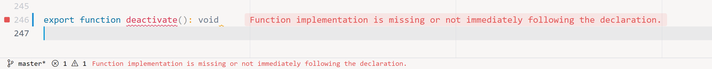

</td>

</tr>
</tbody>
</table>


────────────────────────────────────────────────────────────

### `codexErrorLens.statusBarCommand`

Command that executes on click for Status Bar.

### `codexErrorLens.statusBarMessageTemplate`

Almost the same as [codexErrorLens.messageTemplate](#codexErrorLensmessagetemplate) but instead affects status bar message.

### `codexErrorLens.replace`

Replace message with custom one. Uses strings to create RegExp with `iu` flags.

<table>
<tbody>

<tr>
<td>

```js
"codexErrorLens.replace": [],
```

</td>
<td>

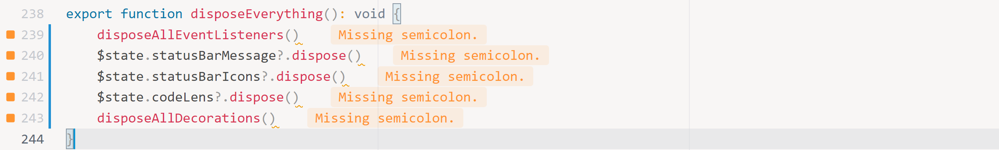

</td>
</tr>
<!-- ──────────────────────────────────────────────────────────── -->
<tr>
<td>

```js
"codexErrorLens.replace": [
    {
        "matcher": "Missing semicolon",
        "message": ";",
    },
],
```

</td>
<td>

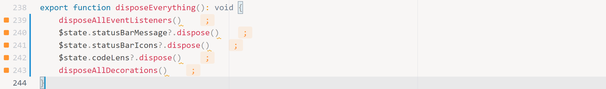

</td>
</tr>
<!-- ──────────────────────────────────────────────────────────── -->
<tr>
<td>

```js
"codexErrorLens.replace": [],
```

</td>
<td>

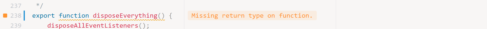

</td>
</tr>
<!-- ──────────────────────────────────────────────────────────── -->
<tr>
<td>

```js
"codexErrorLens.replace": [
    {
        "matcher": "Missing return type on (.+)",
        "message": "Type $1"
    }
],
```

</td>
<td>

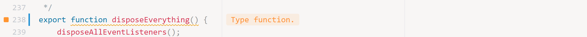

</td>
</tr>
<!-- ──────────────────────────────────────────────────────────── -->
<tr>
<td>

```js
"codexErrorLens.replace": [
    {
        "matcher": "Missing return type on",
        "message": "<==",
    },
],
```

</td>
<td>

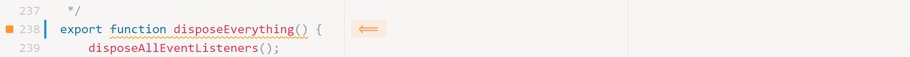

</td>
</tr>
<!-- ──────────────────────────────────────────────────────────── -->
<tr>
<td>

```js
"codexErrorLens.replace": [
    {
        "matcher": "Missing return type on",
        "message": "(。_。)",
    },
],
```

</td>
<td>

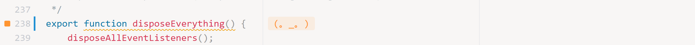

</td>
</tr>
<!-- ──────────────────────────────────────────────────────────── -->

</tbody>
</table>

### `codexErrorLens.transmute`

1. Transmute severity will change decoration's severity (e.g. `error` => `warning`) and can change which decoration is rendered (only 1 decoration with the highest severity is rendered per line).

<table>
<tbody>

<tr>
<td>

```js
"codexErrorLens.transmute": {},
```

</td>
<td>

```js
"codexErrorLens.transmute": {
	"ESLint": {
		"target": {
			"source": "eslint",
		},
		"severity": "info",
	},
},
```

</td>
</tr>

<tr>
<td>

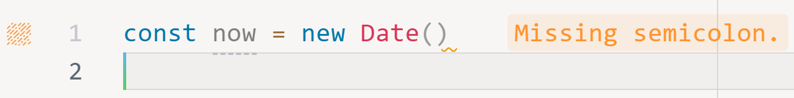

</td>

<td>

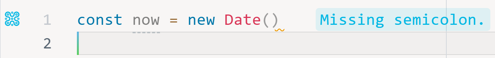

</td>

</tr>
</tbody>
</table>

2. Transmute decoration will change decoration style:

<table>
<tbody>

<tr>
<td>

```js
"codexErrorLens.transmute": {},
```

</td>
<td>

```js
"codexErrorLens.transmute": {
	"semi": {
		"target": {
			"message": "missing semicolon",
		},
		"decoration": {
			"light": {
				"after": {
					"backgroundColor": "#00000010",
					"color": "#444444",
				},
			},
		},
	},
},
```

</td>
</tr>

<tr>
<td>

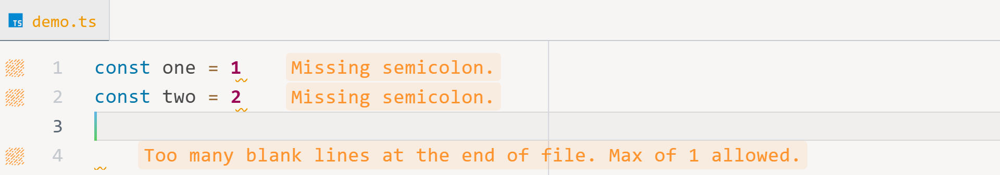

</td>

<td>

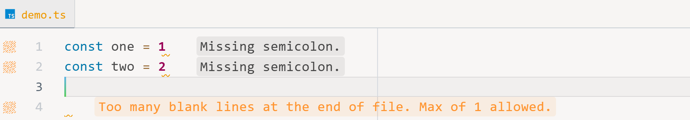

</td>

</tr>
</tbody>
</table>

### `codexErrorLens.excludeByMessage`

Exclude diagnostics by message. Excludes when the diagnostic message contains the matching string(case-insensitive). Can use Regular Expressions (use object instead of a string).

```js
"codexErrorLens.excludeByMessage": [
	"missing semicolon",// string match(includes), case-insensitive
	{
		"regex": "missing semicolon",// RegExp match
		"flags": "iu"
	},
],
```

### `codexErrorLens.excludeBySource`

Exclude diagnostics by source or source+code pair.

### `codexErrorLens.excludePatterns`

Exclude files by using [glob](https://code.visualstudio.com/docs/editor/glob-patterns) pattern (VSCode flavor. May have differences like [Glob matching should be case insensitive Issue#10633](https://github.com/Microsoft/vscode/issues/10633)). Example `[\"**/*.{ts,js}\"]`.

### `codexErrorLens.excludeWorkspaces`

Exclude the entire workspace from highlighting problems. Related Command: `errorlens.toggleWorkspace` .

### `codexErrorLens.disableLineComments`

Used for `codexErrorLens.disableLine` command that adds a comment disabling linter rule for a line.

To force comment on the same line - add `SAME_LINE` to the message: `"eslint": "// eslint-disable-line $code SAME_LINE"`

### `codexErrorLens.lintFilePaths`

Specify where to search for linter rule definitions by diagnostic source ([glob](https://code.visualstudio.com/docs/editor/glob-patterns) for local linter files). `node_modules` folder is excluded. Used when running `codexErrorLens.findLinterRuleDefinition` command.

### `codexErrorLens.searchForProblemQuery`

Pick query to open in default browser when searching for problem with `codexErrorLens.searchForProblem` command.

### `codexErrorLens.selectProblemType`

Which problem to select (closest / active line) when executing `codexErrorLens.selectProblem` command.

- `closestProblem`, - Show closest to the cursor diagnostic
- `closestSeverity` - Show closest to the cursor diagnostic (sorted by severity e.g. error will be shown before warning even if it's farther from the cursor)
- `activeLine` - Show only diagnostic that is on the same line as the cursor.

### `codexErrorLens.light`

Override colors when on of the "light" themes is used. Only for colors that are specified in "settings", not in "colors".

### `codexErrorLens.delay`

Wait this amount (in milliseconds) before showing decorations.

### `codexErrorLens.delayMode`

- `new` - Old/stale problems should disappear immediately while new problems should respect [codexErrorLens.delay](#codexErrorLensdelay)
- `old` - Buggy/Overcomplicated old implementation
- `debounce` - Simply use `debounce()` from `Lodash` library. Old/fixed problems also wait [codexErrorLens.delay](#codexErrorLensdelay) ms before being hidden.

### `codexErrorLens.onSave`

When enabled - updates decorations only on document save (manual, not auto save).

### `codexErrorLens.onSaveTimeout`

Wait this much (ms) before showing decorations after the document save.

### `codexErrorLens.onSaveUpdateOnActiveEditorChange`

Update decorations immediately or not when switching focus from one Text Editor to another.

### `codexErrorLens.enableOnDiffView`

Whether or not to show decorations on `diff` editor.

<table>
<tbody>

<tr>
<th>false</th>
<td>

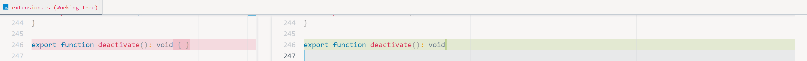

</td>
</tr>

<tr>
<th>true</th>
<td>

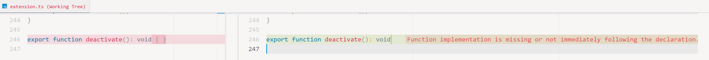

</td>

</tr>
</tbody>
</table>

### `codexErrorLens.followCursor`

Highlight only closest to the cursor problem:

<table>
<tbody>

<tr>
<th align="center">"allLines"</th>
<td>

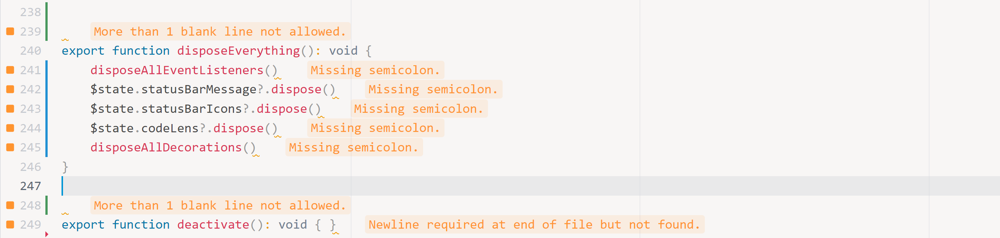

</td>
</tr>

<tr>
<th align="center">"activeLine"</th>
<td>

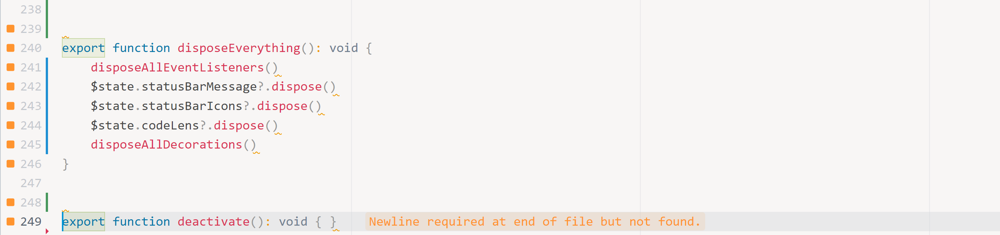

</td>
</tr>

<tr>
<th align="center">"closestProblem"</th>
<td>

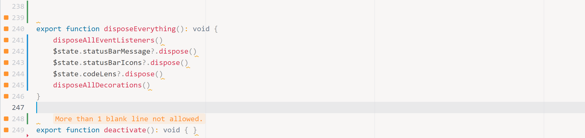

</td>
</tr>

<tr>
<th align="center">"allLinesExceptActive"</th>
<td>

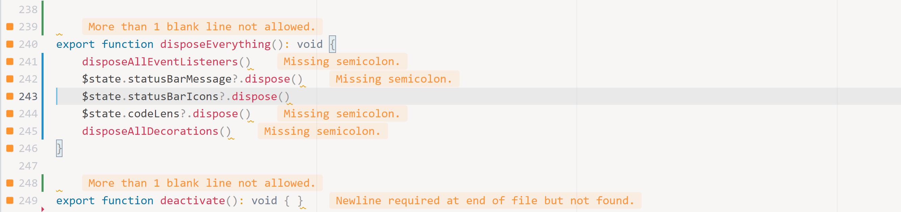

</td>
</tr>

</tbody>
</table>

### `codexErrorLens.followCursorMore`

Augments [codexErrorLens.followCursor](#codexErrorLensfollowcursor) Adds number of lines to top and bottom when `codexErrorLens.followCursor` is set to `activeLine`. Adds number of closest problems when `codexErrorLens.followCursor` is set to `closestProblem`.

<table>
<tbody>

<tr>
<th align="center">0</th>
<td>

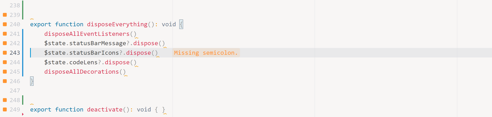

</td>
</tr>

<tr>
<th align="center">1</th>
<td>

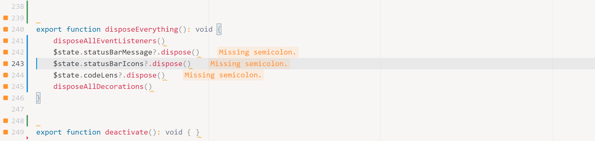

</td>
</tr>

</tbody>
</table>

### `codexErrorLens.gutterIconsEnabled`

Whether to show gutter icons or not.

<table>
<tbody>
<tr>
<th align="center">false</th>
<th align="center">true</th>
</tr>
<tr>
<td>

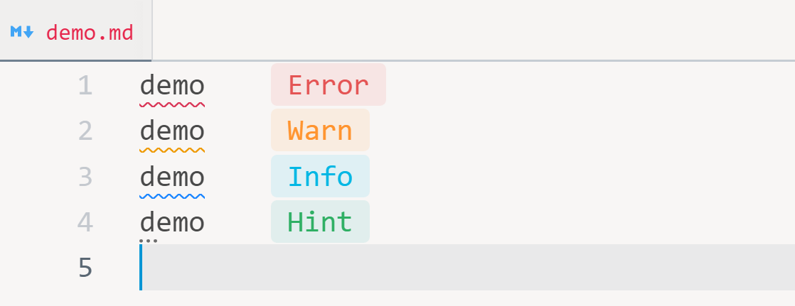

</td>

<td>

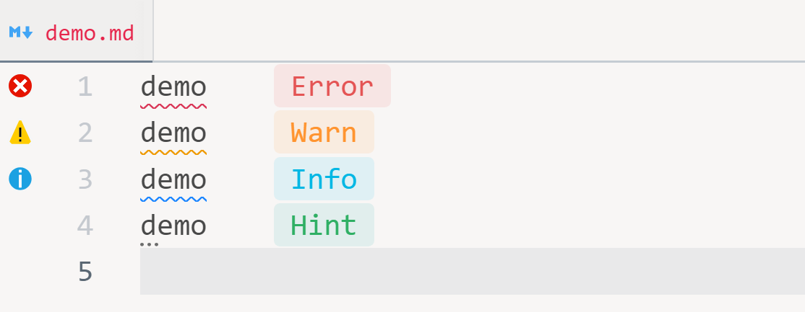

</td>

</tr>
</tbody>
</table>

### `codexErrorLens.gutterIconsFollowCursorOverride`

When enabled and [codexErrorLens.followCursor](#codexErrorLensfollowcursor) setting is not set to `allLines`, then gutter icons would be rendered for all problems. This setting can overcome that:

<table>
<tbody>

<tr>
<td>

```js
"codexErrorLens.gutterIconsEnabled": true,
"codexErrorLens.followCursor": "activeLine",
"codexErrorLens.gutterIconsFollowCursorOverride": true,
```

</td>
<td>

```js
"codexErrorLens.gutterIconsEnabled": true,
"codexErrorLens.followCursor": "activeLine",
"codexErrorLens.gutterIconsFollowCursorOverride": false,
```

</td>
</tr>

<tr>
<td>

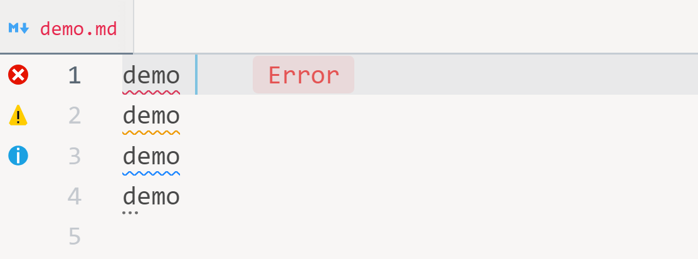

</td>

<td>

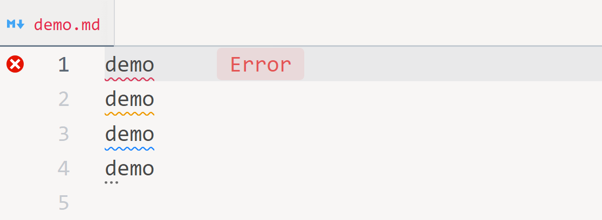

</td>

</tr>
</tbody>
</table>

### `codexErrorLens.gutterIconSize`

Change size of gutter icons:

<table>
<thead>
<tr>
<th align="center">"100%"</th>
<th align="center">"70%"</th>
<th align="center">"150%"</th>
</tr>
</thead>
<tbody>
<tr>
<td>

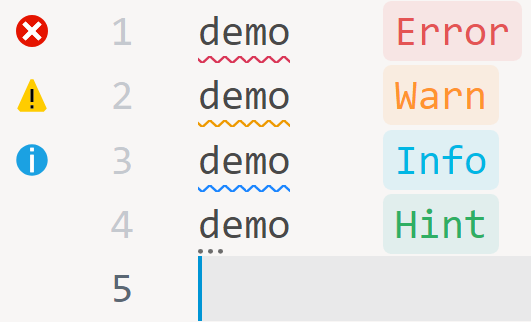

</td>

<td>

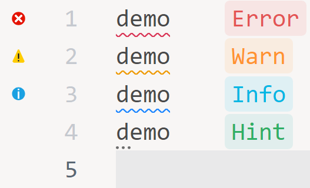

</td>

<td>

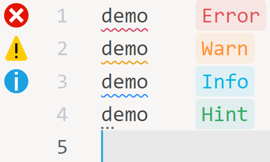

</td>

</tr>
</tbody>
</table>

### `codexErrorLens.gutterIconSet`

<table>
<tbody>

<tr>
<th align="center">"default"</th>
<th align="center">"defaultOutline"</th>
</tr>

<tr>
<td>

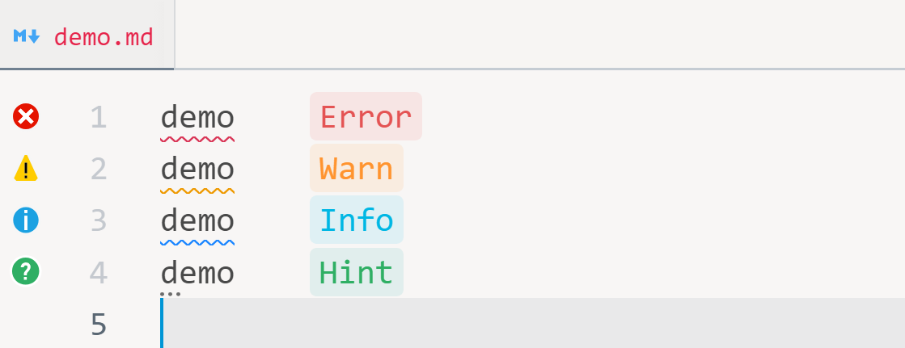

</td>

<td>


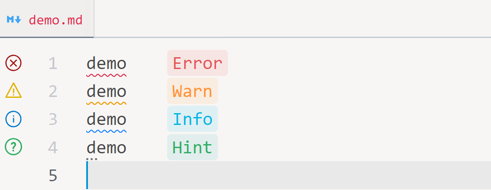

</td>
</tr>

<tr>
<th align="center">"squareRounded"</th>
<th align="center">"circle"</th>
</tr>

<tr>
<td>

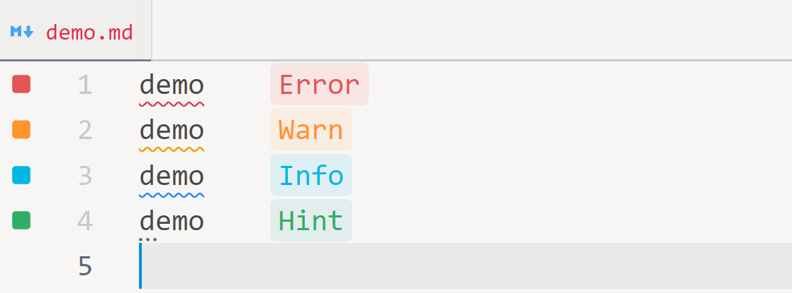

</td>

<td>

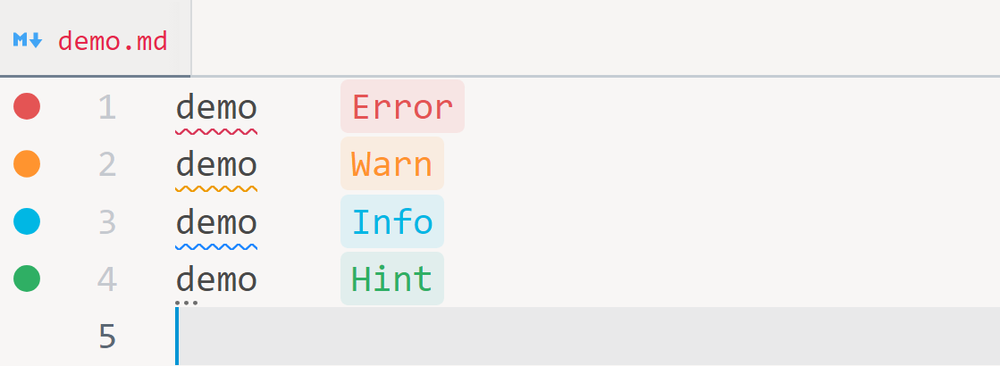

</td>
</tr>

<tr>
<th align="center">"letter"</th>
<th align="center">"emoji"</th>
</tr>

<tr>
<td>

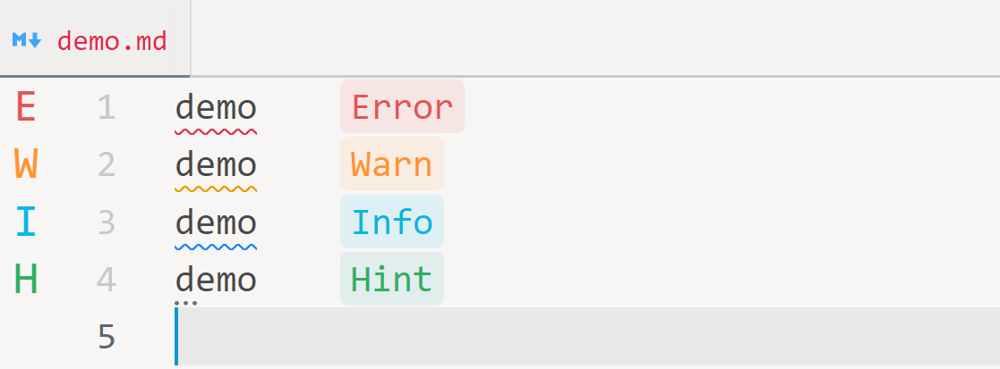

</td>

<td>

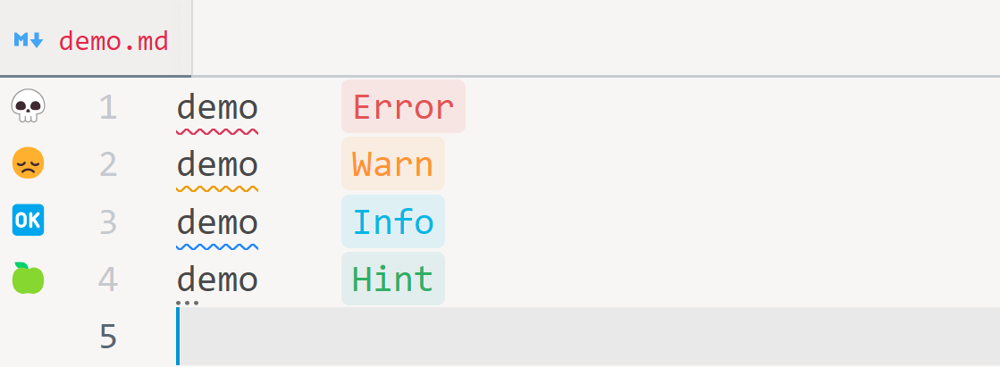

</td>
</tr>

</tbody>
</table>

### `codexErrorLens.gutterEmoji`

Control image shown in gutter when [codexErrorLens.gutterIconSet](#codexErrorLensguttericonset) is `"emoji"`. Can use other utf-8 symbols like ♞/⚃/⛆/★/▣/◈/... Possible to fit 2 symbols that are not as wide as emoji.

<table>
<tbody>
<tr>
<td>

```js
"codexErrorLens.gutterEmoji": {
    "error": "🍎",
    "warning": "🍊",
    "info": "⟁",
    "hint": ":(",
},
```

</td>

<td>

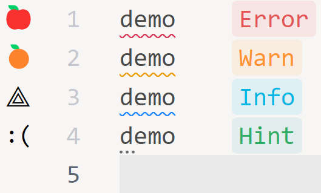

</td>

</tr>
</tbody>
</table>

### `codexErrorLens.errorGutterIconPath`

Set custom icons for gutter.

<table>
<tbody>
<tr>
<td>

```js
"codexErrorLens.errorGutterIconPath": "C:\\temp\\Stop.png",
"codexErrorLens.warningGutterIconPath": "C:\\temp\\Warning.png",
"codexErrorLens.infoGutterIconPath": "C:\\temp\\vscode.png",
"codexErrorLens.hintGutterIconPath": "C:\\temp\\folder.png",
```

</td>

<td>

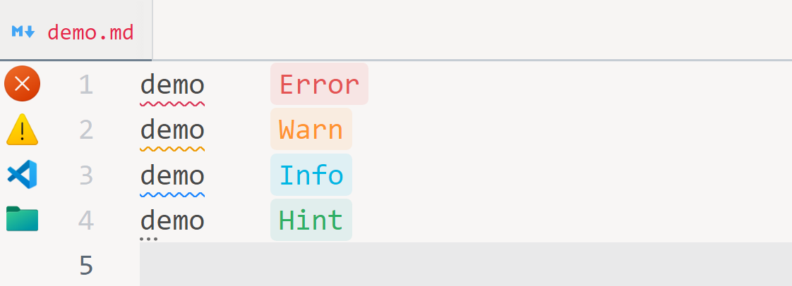

</td>

</tr>
</tbody>
</table>

### `codexErrorLens.warningGutterIconPath`

Same as [codexErrorLens.errorGutterIconPath](#codexErrorLenserrorguttericonpath)

### `codexErrorLens.infoGutterIconPath`

Same as [codexErrorLens.errorGutterIconPath](#codexErrorLenserrorguttericonpath)

### `codexErrorLens.hintGutterIconPath`

Same as [codexErrorLens.errorGutterIconPath](#codexErrorLenserrorguttericonpath)

### `codexErrorLens.errorGutterIconColor`

Change color of gutter icons (for shapes and letters).

<table>
<tbody>

<tr>
<td>

```js
"codexErrorLens.gutterIconSet": "squareRounded",
"codexErrorLens.errorGutterIconColor": "#6a54e4",
"codexErrorLens.warningGutterIconColor": "#29d8ff",
"codexErrorLens.infoGutterIconColor": "#21d439",
"codexErrorLens.hintGutterIconColor": "#b5a7b0",
```

</td>
<td>

```js
"codexErrorLens.gutterIconSet": "letter",
"codexErrorLens.errorGutterIconColor": "#6a54e4",
"codexErrorLens.warningGutterIconColor": "#29d8ff",
"codexErrorLens.infoGutterIconColor": "#21d439",
"codexErrorLens.hintGutterIconColor": "#b5a7b0",
```

</td>
</tr>

<tr>
<td>

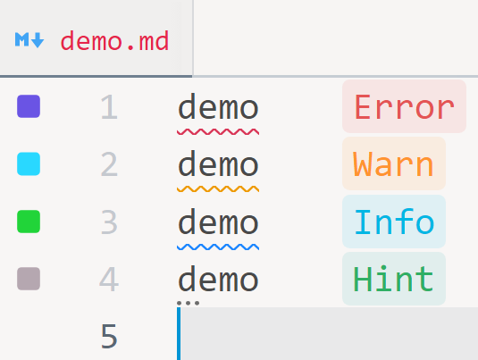

</td>

<td>

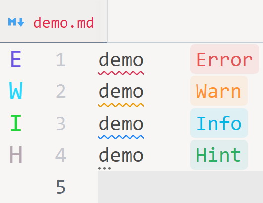

</td>

</tr>
</tbody>
</table>


### `codexErrorLens.warningGutterIconColor`

Same as [codexErrorLens.errorGutterIconPath](#codexErrorLenserrorguttericoncolor)

### `codexErrorLens.infoGutterIconColor`

Same as [codexErrorLens.errorGutterIconPath](#codexErrorLenserrorguttericoncolor)

### `codexErrorLens.hintGutterIconColor`

Same as [codexErrorLens.errorGutterIconPath](#codexErrorLenserrorguttericoncolor)

### `codexErrorLens.removeLinebreaks`

Diagnostic message may contain linebreaks, but inline message decorations are ... inline. This replaces linebreaks (multiple in a row too) with the symbol controlled by [codexErrorLens.replaceLinebreaksSymbol](#codexErrorLensreplacelinebreakssymbol).

### `codexErrorLens.replaceLinebreaksSymbol`

When [codexErrorLens.removeLinebreaks](#codexErrorLensremovelinebreaks) is enabled => replaced linebreaks `\n` with the new symbol that can be represented inline (`⏎` by default).

### `codexErrorLens.scrollbarHackEnabled`

VSCode has a setting to completely disable horizontal scrollbar (better than this scrollbar hack and also will apply to any other extension that contributes inline messages):

```js
"editor.scrollbar.horizontal": "hidden",
```

When showing inline message decorations - VSCode also shows horizontal scrollbar that stays even after message is removed. This is a hack that makes inline message to be absolutely positioned `position:absolute;` to not show any scrollbars. It can make the [codexErrorLens.padding](#codexErrorLenspadding) look differently though.

<table>
<tbody>

<tr>
<th>false</th>
<td>

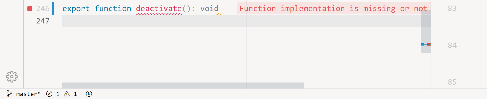

</td>
</tr>

<tr>
<th>true</th>
<td>

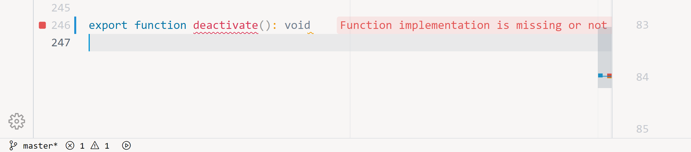

</td>

</tr>
</tbody>
</table>

### `codexErrorLens.decorations`

Advanced control over decorations (only problem message & problem range).

<table>
<tbody>

<tr>
<td>

```js
"codexErrorLens.decorations": {
    "errorMessage": {
        "textDecoration": ";background:linear-gradient(to right, #0088ff, #0a9c33);border-radius:0.3em;padding:0 0.5ch;",
        "color": "#fff",
        "fontWeight": "bold",
    },
},
```

</td>
</tr>

<tr>
<td>

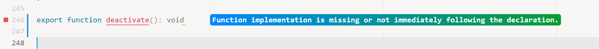

</td>
</tr>

</tbody>
</table>

### `codexErrorLens.ignoreUntitled`

When enabled - will not show any decorations in files with the file scheme `untitled` (newly created unsaved files).

### `codexErrorLens.ignoreDirty`

When enabled - will not show any decorations on Dirty (modified) files. Only when `"files.autoSave"` is disabled (anything except `"afterDelay"`).

### `codexErrorLens.codeLensEnabled`

Show messages as insets between the lines.

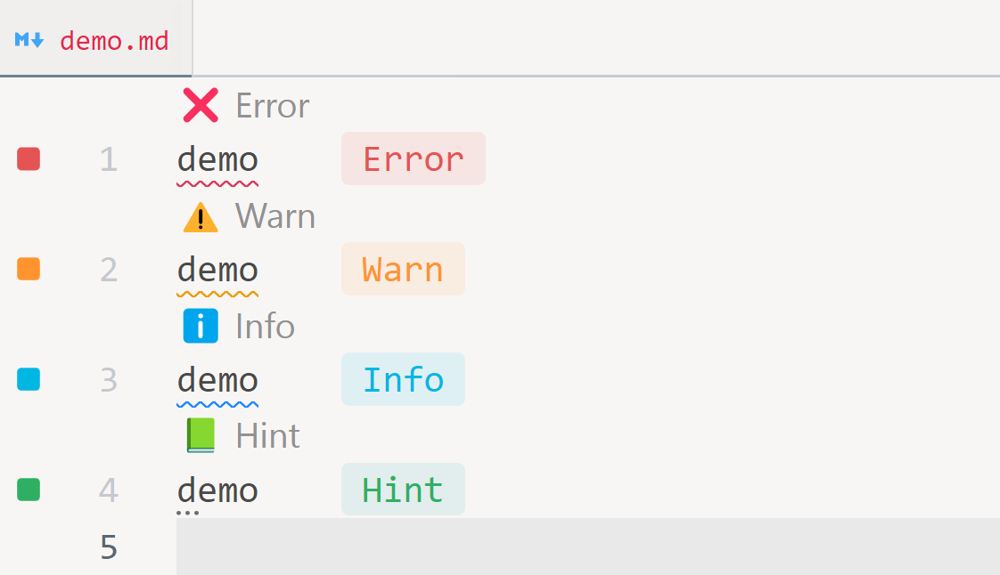

### `codexErrorLens.codeLensLength`

Enforce minimum and maximum length of code lens messages.

### `codexErrorLens.codeLensTemplate`

Almost the same as [codexErrorLens.messageTemplate](#codexErrorLensmessagetemplate), but for the Code Lens feature.

### `codexErrorLens.codeLensOnClick`

Code Lens is clickable. This setting configures what happens when you click on Code Lens message:

- `none` => does nothing
- `showProblemsView` => Open VSCode built-in `Problems` view (runs `workbench.actions.view.problems`)
- `showQuickFix` => Open Quick Fix menu (runs `editor.action.quickFix`)
- `searchForProblem` => Search for problem message in your default browser (runs `codexErrorLens.searchForProblem`)

---

# Miscellaneous

## Custom CSS

Status bar messages can be hard to read, so I'm using [Custom CSS](https://marketplace.visualstudio.com/items?itemName=be5invis.vscode-custom-css) to change the `font-size` of the status bar items:

```css
/* ──── StatusBar ───────────────────────────────────────────── */
.statusbar {
    /* Monospace font and emoji fallback */
	font-family: Menlo, Monaco, Consolas, 'Droid Sans Mono', 'Courier New', monospace, 'Apple Color Emoji', 'Segoe UI Emoji', 'Noto Color Emoji' !important;
	font-size: 14px !important;/* 12px => 14px */
}

.monaco-workbench .part.statusbar > .items-container > .statusbar-item {
	max-width: 70vw !important;/* 40% => 70% Viewport width */
}

.monaco-workbench .part.statusbar > .items-container > .statusbar-item > :first-child {
	margin-left: 0 !important;/* Remove margin (fit more items) */
	margin-right: 0 !important;
}
/* ──────────────────────────────────────────────────────────── */

/* ──── Target only CodeX Error Lens status bar items ─────────────── */
/* "codexErrorLens.statusBarMessageEnabled": true, */
#usernamehw\.errorlens\.codexErrorLensMessage {
    font-size: 14px !important;
}

/* "codexErrorLens.statusBarIconsEnabled": true, */
#usernamehw\.errorlens\.codexErrorLensError {}
#usernamehw\.errorlens\.codexErrorLensWarning {}
/* ──────────────────────────────────────────────────────────── */
```

<table>
<tbody>

<tr>
<td>

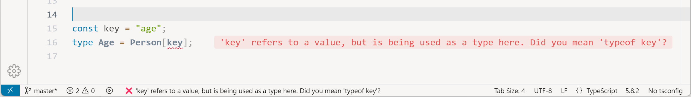

</td>
</tr>

<tr>
<td>

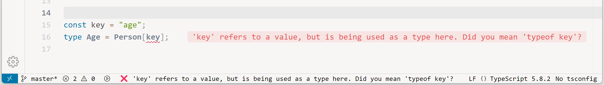

</td>

</tr>
</tbody>
</table>
